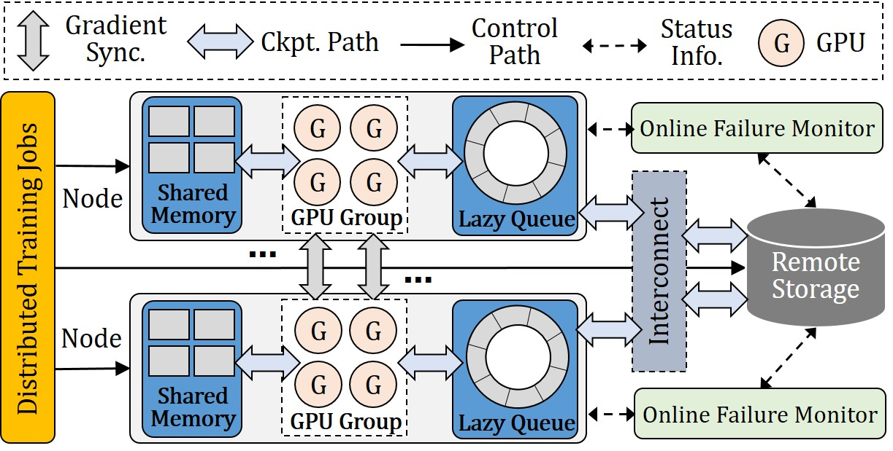

# DelayCheck: Delaying Checkpointing for Efficient Modern Distributed Training

**DelayCheck** is a new checkpointing mechanism for efficient modern distributed training,
which delays and partitions the checkpointing operation until the forward pass ends and the backward pass begins,so as to reduce the training stalls.
Further, **DelayCheck** also proposes an optimized on-disk checkpointing scheme and a fast failure recovery scheme to enhance the performance of **DelayCheck**.

# Implementation

## The system architecture of DelayCheck
**DelayCheck** employs a decoupled and hierarchical storage design for checkpointing and consists of three modules:

1. an in-memory checkpoint creation module
2. an on-disk checkpoint creation module 
3. a failure recovery module

The system architecture of **DelayCheck** is as follows: 

<center class ='img'>

</center>


# Installation

## **Prerequisites**
- Python >= 3.12
- PyTorch-1.3.+
- CUDA-12.6
- DeepSpeed-0.14.5 
- NCCL-2.20.5 
- Hadoop-3.3.6
- Huggingface-0.24.6


## **Get the code**
```shell
git clone https://github.com/FAST26-DelayCheck/DelayCheck
cd DelayCheck
pip install -r requirements.txt
python setup.py
```

## **Quick start**

We provide codes for seven types of checkpointing solutions. They are DataStates-LLM, FastPersist, Gemini, DeepFreeze, CheckFreq, TorchSnapshot and DelayCheck. For each methods, there are codes for six models, which are GPT2, BERT, RoBERT, BLOOM, ResNet and VIT.

For example, to run gpt2-10B with DelayCheck:


```shell
cd delaycheck/example/llm/gpt2
bash run_clm_no_trainer_ds_gpt2_layer_10B_delay.sh
```


## **Referred Datasets**


- Wikitex-103/2: [https://huggingface.co/datasets/wikitext](https://huggingface.co/datasets/wikitext)
- SQuAD: [https://rajpurkar.github.io/SQuAD-explorer/](https://rajpurkar.github.io/SQuAD-explorer/)
- ImageNet: [https://www.image-net.org/](https://www.image-net.org/)


