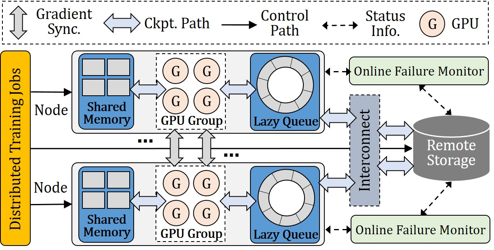

# OTeacheck

**One-iTeration-ahead Checkpointing**, called **OTeacheck**, is an iteration-level checkpointing solution that minimizes the impact on the training process, including in-memory checkpointing and on-disk checkpointing. OTeaCheck partitions the checkpoints based on a gradient merging strategy and fills them into pipeline bubbles within an iteration to avoid training blocking and allocates only a small GPU buffer for all partition checkpoints and stores them sequentially to avoid GPU out-of-memory. This repository contains **OTeacheck**'s source code, as well as a set of benchmarking scripts for some existing state-of-the-art checkpointing solutions.

# Implementation

## The system architecture of OTeaCheck
**OTeaCheck** employs a decoupled and hierarchical storage design for checkpointing and consists of three modules:   

1. an in-memory checkpoint creation module
2.  an on-disk checkpoint creation module 
3. a failure recovery module

The system architecture of **OTeaCheck** is as follows: 

<center class ='img'>

</center>


# Installation

## **Prerequisites**
- CUDA-12.6
- DeepSpeed-0.14.5 
- NCCL-2.20.5 
- Hadoop-3.3.6
- Huggingface-0.24.6

## **Get the code**
```shell
git clone https://github.com/EuroSys25-OTeaCheck
cd EuroSys25-OTeaCheck
pip install -r requirements.txt
python setup.py
```

## **Quick start**

Codes of four types of checkpointing methods are provided. They are baseline, CheckFreq, tsnapshot and OTeacheck. For each methods, there are codes for four models, which are BERT, GPT2, ResNet and VIT.

For example, to run BERT with OTeacheck:

```shell
cd oteacheck/bert
bash nvidia_run_squad_ds_lib_oteacheck.sh
```

## **Referred Datasets**

- ImageNet: [https://www.image-net.org/](https://www.image-net.org/)
- Wikitex-103: [https://huggingface.co/datasets/wikitext](https://huggingface.co/datasets/wikitext)
- SQuAD: [https://rajpurkar.github.io/SQuAD-explorer/](https://rajpurkar.github.io/SQuAD-explorer/)