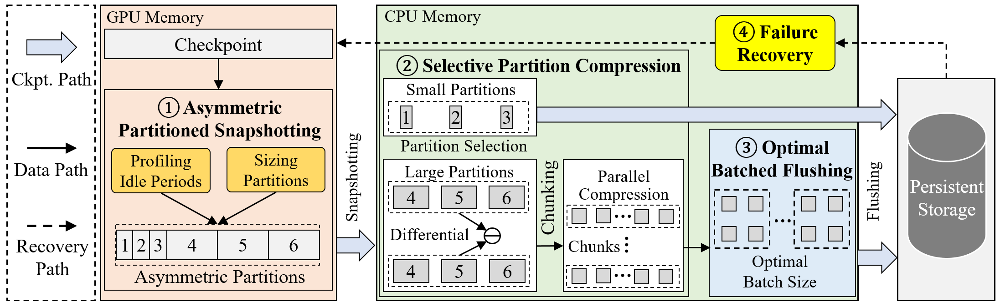

# AsymCheck: Asymmetric Partitioned Checkpointing for Efficient Large Language Model Training

**AsymCheck** is an asymmetric partitioned checkpointing mechanism that adjusts partition sizes for efficient LLM training, using smaller partitions for forward passes and larger partitions for backward passes.
Further, **AsymCheck** incorporates two key techniques: (i) a selective partition compression scheme to reduce checkpoint size with low compression overhead and (ii) a batched flushing mechanism to minimize persistence latency.

# Implementation

## The system architecture of AsymCheck
**AsymCheck** employs a decoupled and hierarchical storage design for checkpointing and consists of four modules:

1. an asymmetric partitioned snapshotting module
2. a selective partition compression module
3. an optimal batched flushing module
4. a failure recovery module


The system architecture of **AsymCheck** is as follows: 

<center class ='img'>

</center>


# Installation

## **Prerequisites**
- Python >= 3.12
- PyTorch-1.3.+
- CUDA-12.6
- DeepSpeed-0.14.5 
- NCCL-2.20.5 
- Hadoop-3.3.6
- Huggingface-0.24.6


## **Get the code**
``` shell
git clone https://github.com/ASPLOS26-AsymCheck/AsymCheck
cd AsymCheck
pip install -r requirements.txt
python setup.py
```

## **Quick start**

We provide codes for seven types of checkpointing solutions. They are ExCP, DataStates-LLM, PCcheck, Gemini, CheckFreq, and AsymCheck. For each method, there are codes for six models, which are GPT2, BERT, RoBERT, BLOOM, ResNet, and ViT.

For example, to run gpt2-10B with AsymCheck:


``` shell
cd AsymCheck/example/llm/gpt2
bash run_clm_no_trainer_ds_gpt2_layer_10B_asym.sh
```


## **Referred Datasets**


- Wikitex-103/2: [https://huggingface.co/datasets/wikitext](https://huggingface.co/datasets/wikitext)
- SQuAD: [https://rajpurkar.github.io/SQuAD-explorer/](https://rajpurkar.github.io/SQuAD-explorer/)
- ImageNet: [https://www.image-net.org/](https://www.image-net.org/)


